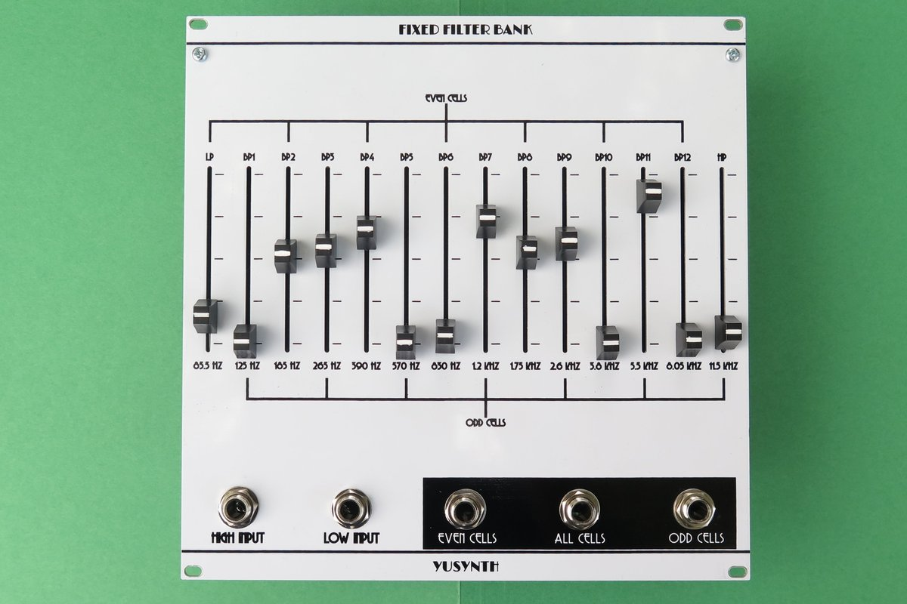
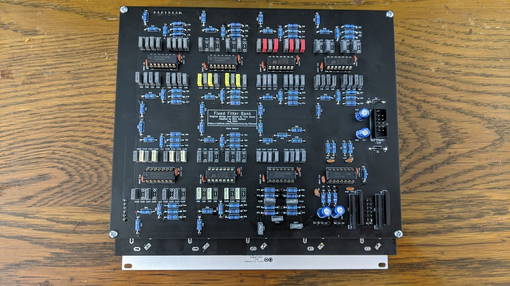

# YuSynth Fixed Filter Bank (modified)

This is a somewhat modified version of Yves Usson's [module](https://www.yusynth.net/Modular/EN/BANK/index.html) in Kosmo format. Changes are:

* Tuning.
* Addition of auxiliary PCB for board mounted slide pots and jacks (instead of Usson's panel mounted, wired rotary pots and jacks).
* Relocation of headers on main PCB to accommodate mating with sockets on panel components PCB. Ribbon cable is replaced by mated header/socket.
* Use of dual bypass caps (one from each rail to ground instead of one between the two rails).
* Omission of MOTM and MTA power headers.

## Errata

**WARNING!** On the first run PCBs (marked Aug 2021, no version number) the power connections to the ICs were reversed. To get around this, install all ICs "backwards", opposite the direction indicated on the silkscreen. The error has been corrected in the design files — by rerouting the power, not by turning the ICs — and power connections are correct on boards marked v1.0 (Oct 2021) or later. If in doubt use your multimeter before installing ICs to verify +12 V is on pin 4, -12 V is on pin 11. A good idea any time you build a module anyway, especially one with eight ICs!

## Tuning
Usson's filters are tuned to the same frequencies as in the Moog 914 module, except that for some reason he used 750 Hz instead of 700 Hz. The Moog filter frequencies are about six semitones (half an octave) apart. But note the following observation from the catalog description of the [Serge Resonant Equalizer](https://www.elby-designs.com/webtek/cgs/serge/cgs202/cgs202.htm): 

> Except for the top and bottom frequency bands, all other bands are spaced at an interval of a major seventh. This non-standard spacing avoids the very common effect of an accentuated resonance in one key, as will be the effect from graphic equalizers with octave or third-octave spacing between bands. Spacing by octaves will reinforce a regular overtone structure for one musical key, thereby producing regularly spaced formants accenting a particular tonality. The Resonant Equalizer's band spacing are much more interesting, producing formant peaks and valleys that are similar to those in acoustic instument sounds.

Following something like this idea, I have retuned Usson's module. Specifically, the first band pass is kept at 125 Hz and the other filters are tuned at six and a half semitones apart. 

For a list of the new frequencies, new capacitor values for the low pass and band pass filters, and new resistor values for the high pass filter, see [retuning.md](Docs/retuning.md).

In the tuning Usson used, all the required capacitances are non standard values, so he used pairs of standard value capacitors adding to the required value. Note that in this new tuning several of the required capacitances come out to available standard values. For those, only a single capacitor instead of two is used (saving 20 capacitors! Though this is partly offset by my use of dual bypass caps.) The unneeded capacitors are shown (marked DNF, "do not fit") in the schematic and have footprints on the PCB, in case I or anyone else ever wants to use this board for a differently-tuned version. For a build with my tuning, these footprints should be left unpopulated.

## YuSynth request

Usson writes: 'All circuits, schematics, printed circuit board, panel design and associated data published on \[yusynth.net\] can be used for private use only.' I do not believe this repo violates his wishes and you are urged to respect them as well. CC0 licensing is intended to cover my modifications and original work, not to negate Usson's rights regarding his designs.

## Photos




## Documentation:

* [Schematic](Docs/ysFFB.pdf)
* PCB layout: [front](Docs/ysFFB_layout_front.pdf), [back](Docs/ysFFB_layout_back.pdf)
* [BOM](Docs/ysFFB_bom.md)
* [Build notes](Docs/build.md)
* [Retuning](Docs/retuning.md)

## GitHub repository

* [https://github.com/holmesrichards/ffbmod](https://github.com/holmesrichards/ffbmod)

## Submodules

This repo uses submodules aoKicad and Kosmo_panel, providing libraries needed for KiCad. To clone:

```
git clone git@github.com:holmesrichards/ffb.git
git submodule init
git submodule update
```


Alternatively do

```
git clone --recurse-submodules git@github.com:holmesrichards/ffb.git
```

Or if you download the repository as a zip file, you must also click on the "aoKicad" and "Kosmo\_panel" links on the GitHub page (they'll have "@ something" after them) and download them as separate zip files which you can unzip into this repo's aoKicad and Kosmo\_panel directories.

If desired, copy the files from aoKicad and Kosmo\_panel to wherever you prefer (your KiCad user library directory, for instance, if you have one). Then in KiCad, add symbol libraries 

```
aoKicad/ao_symbols
Kosmo_panel/Kosmo
```
and footprint libraries 
```
aoKicad/ao_tht
Kosmo_panel/Kosmo_panel.
```
